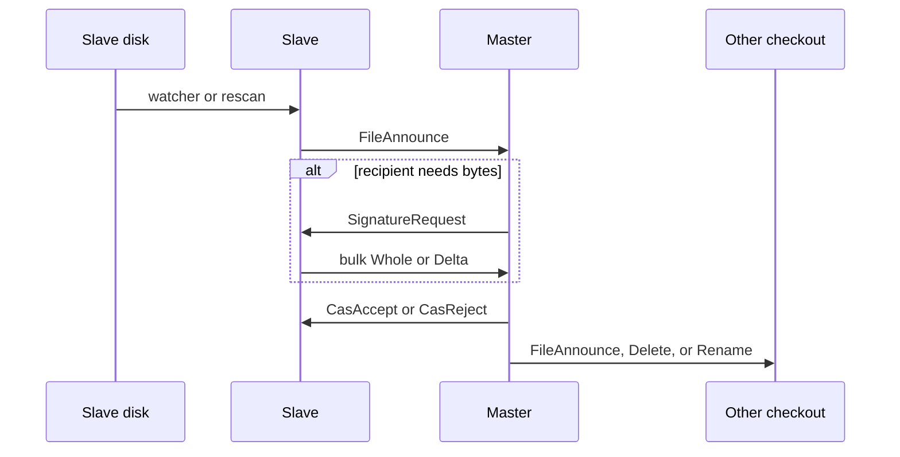

# How ArborSync is put together

Start here. [`spec.md`](spec.md) is the contract. This page is the picture that contract sits in.

You are looking at a central-master file sync daemon. One process owns a tree. Other processes check out prefixes of that tree onto their own disks. A change anywhere is accepted or rejected on the master. The live path everywhere then follows that decision. The loser is copied aside, never overwritten.

The binary is `arborsync`. The library is `arborsync-core`. Tests drive the library with injected messages. The binary owns Quinn, `notify`, signals, and reconnect.

## The star

There is one master and many slaves. There is no second master, no shard, and no shared cluster secret.

The master binds `central_root` on disk and listens on UDP. Each slave opens one QUIC connection and identifies itself with a persisted X25519 static key. After Noise XX, the master looks that key up in `[[slaves]]`. The matching row supplies `slave_id` and `allowed_prefixes`. An unknown key is a disconnect.

A slave then sends `Subscribe` with checkout ids and central prefixes only. Local paths stay on the slave. The master records interest for the connected session and forgets it on disconnect. Offline slaves keep no queue. Catch-up is reconnect plus reconcile.

## Canonical path

Every index key, Merkle walk, and wire path is a **canonical path**. That is an absolute path in the logical tree, never including `central_root`.

The OS file `/central/src/foo.rs` is canonical `/src/foo.rs`. The hierarchy root is `/`. Sibling `/src` does not match `/src2`. Prefix means equal, or the longer path starts with the prefix plus `/`. `/` matches everything.

In-tree symlinks are first-class. The scan stores the target and does not follow it. Following would escape the checkout and duplicate leaves. Only `central_root` and each checkout `local` are `canonicalize`d, and only at process open.

Reserved names at those roots are `.arborsync-tmp` and `.arborsync-conflicts`. They are not indexed and not synced. The watcher still sees them. Core drops the event.

## Checkout

A checkout is `{ id, central, local }` on one slave.

- `id` is a stable string and the index prefix for that checkout. Changing it is remove plus add.
- `central` is the canonical prefix this checkout cares about.
- `local` is the absolute host path.

Local paths on one slave must not overlap. `/opt/a` and `/opt/a/b` are illegal. `/opt/a` and `/opt/ab` are fine. Central prefixes on one slave may overlap. A backup host often maps `/src` and `/` at once. Each checkout is an independent replica with its own `last_synced` and its own sidecars.

A checkout is interested in canonical path `P` when `central` is a prefix of `P`. Fan-out is one announce per interested `(slave_id, checkout_id)`. The pair that just committed is skipped.

## Directory hash tree

Each index is a path-addressed tree, not a flat Merkle leaf list. Do not reach for `rs_merkle`.

A file or symlink has a `FileNode`:

```
BLAKE3(kind || content_hash || size || mtime_ns || mode)
```

A directory has a `DirNode`: BLAKE3 of its children, sorted as raw UTF-8 names. The empty directory is `BLAKE3("")`. The path is the walk from `/`. It is not hashed into the node.

`FileNode` is the CAS object. `DirNode` is recomputed after children change. Insert and delete touch only ancestor directory hashes.

If two subtree roots differ, the slave asks for that directory's child list and recurses where hashes differ. Cost follows the symmetric difference. There is no inclusion proof.

## How a change travels



The fast path is the watcher. `notify-debouncer-full` keeps Create, Write, Remove, Rename, and `Modify(Metadata)`. The binary maps `notify::Event` to `WatchEvent`, then core `to_local_events` produces `LocalEvent`. A same-window same-checkout rename is one `ProtocolMessage::Rename`. Unpaired or cross-checkout rename stays Delete plus Create. Apply is `fs::rename` plus index update, not a bulk copy. Config reload stays on `notify-debouncer-mini`.

The slave updates that checkout's index and, when `FileNode` is not `last_synced`, sends `FileAnnounce`. Production `WholeFileLater` never holds file bytes. The recipient sends `SignatureRequest`. The sender opens a bulk stream with whole bytes or a `copia` delta. A whole-file apply writes each chunk to `.arborsync-tmp`, `fsync`s, hashes the file, then `rename`s onto the live path. A delta patches onto a tmp file the same way.

`commit_leaf` writes the leaf, every ancestor `DirNode`, and `last_synced` in one redb batch. Slave `rescan` uses `commit_leaves` so one walk is one batch. The slave holds hashed announces until 64 are ready or hashing workers are idle, then one `commit_leaves` writes them. Master apply and a single watcher announce still commit per path. The master and the slave keep directory children in memory after the first listing so a long copy or rescan does not scan the whole index on every file. Each loaded directory keeps its children ordered by UTF-8 name and keeps the spec concat next to them. A sibling announce patches that child's hash. One new child is spliced into the concat at its UTF-8 offset. A `commit_leaves` of more than one path, a delete, or a kind change marks the concat stale, and that commit rebuilds the directory once, then the parent BLAKE3s it. The master then fans out to connected interested checkouts.

`inflight` remembers the content hash just applied so the local watcher does not re-announce the write. The map expires after twice the debounce. The code arms it before the live `rename`, `mkdir`, or meta apply, including dirs (`ContentHash::ZERO`) and meta-only apply. A type-change vacate can look like `Remove`; that event is dropped while the path is armed.

## CAS and the sidecar

The master is the replica of record. The winner is whatever CAS commits there.

- Create: `basis` is `None`. Accept if the path is absent.
- Update or delete: accept if the live `FileNode` equals `basis`.
- Success: `CasAccept`. The origin slave sets `last_synced` from that reply.
- Failure: `CasReject`. The slave writes its bytes under `.arborsync-conflicts` when content differs, then adopts the winner.

The sidecar path is `{local}/.arborsync-conflicts/{canonical}--{first 16 hex chars of the losing content hash}`. Announce apply, `CasReject`, and incoming `Delete` skip the sidecar when only metadata changed.

Type change (file to dir, or the reverse) is one master transaction. The master accepts when `FileNode(previous)` equals `basis`, deletes the old kind, creates the new kind, and fans out one `FileAnnounce`.

Master `publish` writes the new live file and does not sidecar a successful replace. Slave apply follows the table above.

## Reconcile

Watchers drop events. Correctness is the slow path.

After `SubscribeAck`, after every rescan, and after reconnect, the slave sends `RootReport` for each checkout. `SubscribeAck` first rewrites any directory hash that does not match its indexed children. The master replies `RootAck` with `matched` and its subtree root. On mismatch the slave walks `DirListRequest` and `DirListResponse` and runs a 3-way on `last_synced`. A wide directory arrives as more than one `DirListResponse` when one frame would exceed 1 MiB.

- Local equals last-synced and master differs: pull.
- Master equals last-synced and local differs: announce.
- Both differ: announce, then expect `CasAccept` or `CasReject`.
- Name only on the slave: announce create, including when local still equals `last_synced`. That agreement is cleared first. `Master::open` surveys the disk, so an index row for a file that is gone does not keep the roots matched.

Initial populate is the same walk with `last_synced` empty. A directory that exists only on the slave is announced, then the slave sends `DirListRequest` for that path so nested leftover files are in the same session. The slave binary writes those announces on a task that does not own `read_control`, so inbound `SignatureRequest`s can start leftover bulk. File reads for those asks run off the session task. `kick` admits the next parked ask from the size stored when the ask was parked, not a redb walk of the parked set. Leftover dir-list pages wait while asks are parked or in flight. Rescan hashing still steps during that fulfill. A second ask for the same path and hash is dropped while that ask is parked or in flight. After the send finishes, the master re-asks when a fresh gauge shows the slave idle and the pending row is older than one status interval. A late bulk whose pending row is gone still applies when the live file already matches. A pull `SignatureRequest` after `CasReject` uses a second writer lane so master copies are not stuck behind the leftover announce flood.

Rescan is a full `stat` walk, not a dirty-subtree walk. `collect_for_rescan` hashes again only when kind, size, or mtime disagree with the index. Mode is not a miss. Create, Write, Metadata, Rename, and master `walk_central` use that path too. The 60 s timer is `recv_timeout` on the notify channel, so a busy tree delays rescan. Rescan `lstat` runs off the session task, 64 names at a time, so `read_control` and the hash pump stay live while those stats are in flight. A partial directory is not a delete. A dir-list `Delete` waits until that rescan finishes. The session announces new index rows as stats return, and sends `RootReport` on `SubscribeAck` before the walk finishes so leftover copy can start. Known index rows still reconcile via that `RootReport`. Interval `status` keeps printing. The slave watch thread queues a rescan. The session drains it. The master watch thread stats `central_root` and reads the index without the session mutex, then locks only to commit rows a second stat still confirms, so leftover apply can take the mutex during the walk.

## Identity and reload

`arborsync keygen --out PATH` writes a 32-byte secret at mode `0600` and prints `hex:` plus 64 hex digits. That pin is what XX authenticates.
`arborsync path` prints the disk row and the index row for one host or canonical path, including `last_synced`, so a missing file can be compared on the master and the slave.
`master` and `slave` log that pin at startup after they read the secret file.

Config is TOML. `--config` and `ARBORSYNC_CONFIG` pick the file. `ARBORSYNC_LOG_LEVEL` overrides `log_level`. Key material does not go in the environment.

SIGHUP and a watch on the config's parent directory reload live fields: log level, rate limits, ACL rows, extra public keys, checkout add or remove, debounce, rescan interval, status interval, `[tune.hashing].workers`, and slave `[tune.fulfill_parked].inflight`. `listen_addr`, `db_path`, `central_root`, `master_addr`, and key paths need a restart. Changing slave `slave_id` also needs a restart.

A new session with a valid key for an already-connected `slave_id` replaces the old session. The binary `close`s the previous connection and signals the old task. Roster interest switches on the new `Subscribe`.

On `SubscribeReject` the slave records `denied_centrals`, omits those prefixes from the next `subscribe()`, and stays on the same connection when any checkout remains. All denied is hangup. Cleared when checkouts or pins change.

Tightening `allowed_prefixes` drops those checkouts from interest and leaves the connection up. The slave is not told. Later `RootReport`s for those ids come back `not_subscribed`.

## Where the code lives

| Question | Look here |
|---|---|
| Contract | `doc/spec.md` |
| Framing, `ProtocolMessage` | `core/src/protocol.rs` |
| Noise XX, streams, attempt limiter | `core/src/transport.rs` |
| TOML and reload plan | `core/src/config.rs` |
| Hop knobs | `core/src/tune.rs` |
| Off-lock hash jobs | `core/src/hashing.rs` |
| Canonical paths, reserved names, overlap | `core/src/path.rs` |
| `FileNode` and `DirNode` | `core/src/merkle.rs`, `core/src/hash.rs` |
| Stat, hash, skip devices | `core/src/meta.rs` |
| One-batch leaf plus ancestors | `core/src/index.rs` |
| redb tables | `core/src/storage.rs` |
| CAS, fan-out, roster | `core/src/master.rs` |
| Announce, apply, walk | `core/src/slave.rs` |
| Walk table only | `core/src/reconcile.rs` |
| Tmp, rename, sidecar | `core/src/apply.rs` |
| `copia` signature and patch | `core/src/transfer.rs` |
| Accept, watch, SIGHUP | `src/master.rs`, `src/slave.rs`, `src/reload.rs`, `src/watch.rs` |
| Watch kinds to `LocalEvent` | `core/src/watch.rs` |
| Echo `inflight` | `core/src/inflight.rs` |

`ContentHook` is how tests skip the network. `MemoryContent` returns bytes immediately. `WholeFileLater` always returns `AskSender`, which is what the daemons use.

`Transport` is a live session after handshake. `impl Transport for quinn::Connection` is the QUIC path. The binaries call that impl. `MemoryTransport::pair` is the in-memory test impl and has no datagrams. `pair_with_datagrams` is the opt-in that carries gauges. Unit tests still call `Master::handle` and `Slave::handle`.

## Status

`spec.md` §16 items 1 through 8 are built. The §11 peer directory query is built. A slave socket serves one snapshot of the other slaves. `[tune.hashing]` and slave `[tune.fulfill_parked]` apply on SIGHUP. The struck `quic_*` / `reconnect_*` keys are not fields. Reconnect backoff is 1 s, doubling, cap 60 s. `flake.nix` and `nix/module.nix` expose `services.arborsync.master` so NixOS can run that same `arborsync master` binary. There is no NixOS option for the tune tables.

`core/tests/scenarios.rs` names the §16.8 cases and drives them through `handle` and `note_local` on `MemoryStorage`. `src/watch.rs` starts a real `notify-debouncer-full` thread. `tests/sync.rs` starts master and slave over QUIC and asserts a post-connect write crosses.

`arborsync-fuzz` is a separate workspace binary. It starts its own master and slave under a temp directory. A connected master's `status` line stayed `health=busy` on every sampled second while rescan windows and root-report windows alternated. `pending=0` on those lines. The slave line did reach `health=idle`. Seeds 3, 11, and 13 (`--steps 12 --slaves 1`) and seeds 1 and 5 (`--steps 16 --slaves 2`) exited 0 after the fuzzer used that split. Grammar and bad-bulk injection are not generated. See [fuzzing.md](fuzzing.md).

A directory create that lands while children are already on disk walks those children into the same `HashPlan`. Seed 8 (`--steps 16 --slaves 1`) and the shrunk seed 6 `nested/z` artifact exit 0.

## What to read next

| If you need | Open |
|---|---|
| The contract | [`spec.md`](spec.md) |
| Checkout, ACL, Subscribe | [`subscriptions.md`](subscriptions.md) |
| Node encodings and the walk | [`building-updating-merkle-trees.md`](building-updating-merkle-trees.md) |
| Stat, mode, symlinks | [`collecting-metadata.md`](collecting-metadata.md) |
| redb tables and batches | [`indexing.md`](indexing.md) |
| Watcher and rescan | [`filesystem-scanning-watching.md`](filesystem-scanning-watching.md) |
| CAS, sidecar, `copia` | [`applying-updates.md`](applying-updates.md) |
| Fan-out and reconcile triggers | [`pushing-updates.md`](pushing-updates.md) |
| Frames, XX, streams | [`quic-transport.md`](quic-transport.md) |
| TOML, reload, env | [`configuration.md`](configuration.md) |
| Restore a prefix | [`restoring.md`](restoring.md) |
| Run a private campaign | [`fuzzing.md`](fuzzing.md) |
